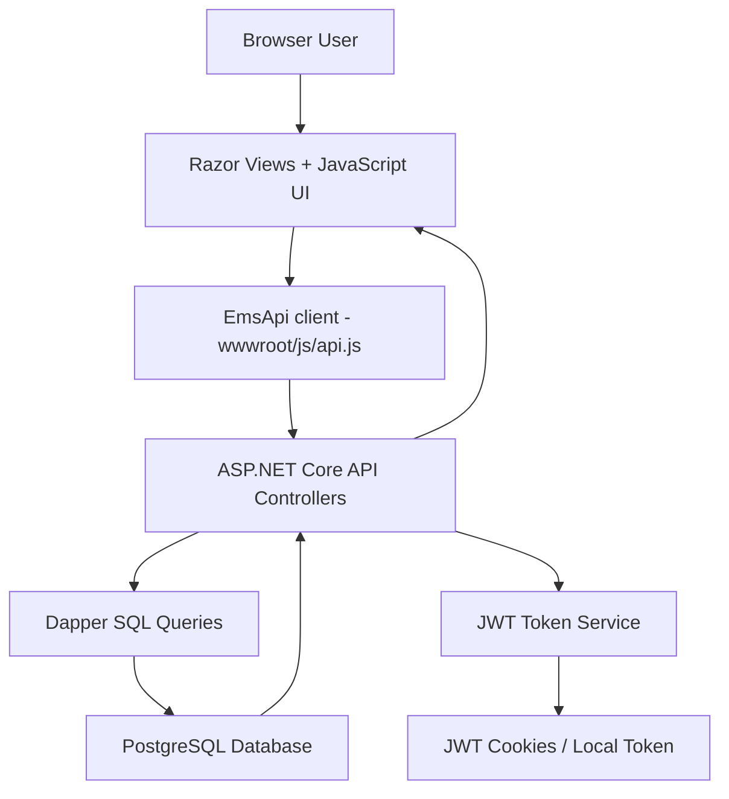
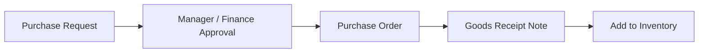
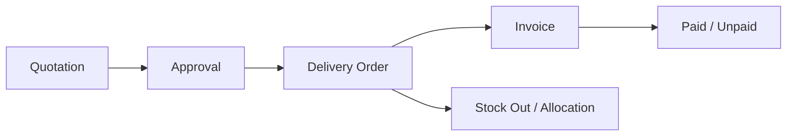
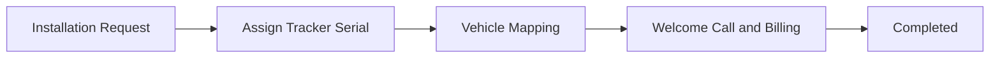
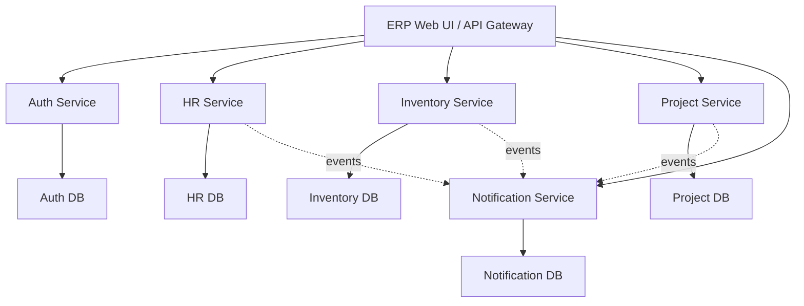

# TRACK360 ERP - Project Overview and Interview Guide

This file explains the complete project from basic to advanced level: tech stack, architecture, modules, database, APIs, coding techniques, deployment, and interview-ready talking points.

## 1. Project Summary

TRACK360 ERP is an Enterprise Resource Planning web application built for ESSPL-style internal operations. It combines HR management, inventory and invoicing, employee self-service, project management, announcements, accounts, audit logs, and configuration modules inside one professional dashboard interface.

The project currently runs as a single ASP.NET Core MVC application with modular boundaries. That means it is a modular monolith, not fully separated deployed microservices yet. The structure is microservice-ready because Auth, HR, Inventory, Projects, Accounts, and Workspace APIs are separated by controllers and database domains.

Main business goal:

- One login system for Super Admin, HR Manager, and Employee.
- Super Admin/HR can access ERP modules, HR workspace, inventory, accounts, settings, payroll, leave, attendance, and reports.
- Employee users are restricted to their own portal only.
- Inventory includes stock-in, stock-out, purchase requests, purchase orders, GRNs, quotations, delivery orders, invoices, installations, complaints, replacements, customers, vendors, products, and serial tracking.
- Data is saved in PostgreSQL through .NET APIs.

## 2. Current Tech Stack

### Backend

- ASP.NET Core MVC / Web API
- .NET 8 target framework
- C#
- JWT Bearer Authentication
- Cookie-based session support for browser pages
- Dapper micro ORM
- Npgsql PostgreSQL driver
- BCrypt.Net-Next for password hashing and verification

### Frontend

- Razor Views (`.cshtml`)
- HTML5
- CSS3 custom design system
- Vanilla JavaScript
- Bootstrap static assets are present in `wwwroot/lib`
- jQuery static assets are present, though most custom features use plain JavaScript

### Database

- PostgreSQL
- Database access through `NpgsqlDataSource`
- SQL written directly with Dapper
- Tables are organized around HR, Inventory, Projects, Users, Payroll, and Settings

### Authentication and Security

- JWT tokens signed with HMAC SHA256
- JWT stored in secure cookies and client fallback cookie/localStorage depending on environment
- Password hashes verified with BCrypt
- Role-aware middleware in `Program.cs`
- Employee users are restricted from admin/inventory/project areas
- Static file hardening blocks direct access to `.dll`, `.pdb`, `.csproj`, `.sln`, `.json` app files

### Deployment / Hosting

- IIS / Somee compatible `web.config`
- Dockerfile exists
- Railway config exists
- Render blueprint exists
- GitHub Pages demo launcher exists in `docs`
- Cloudflare quick tunnel was used for HTTPS demo sharing

Important deployment note:

- Somee free hosting served the app over `http`, but its `https` support was unreliable.
- For a professional lead/client review, use a hosting provider with stable .NET + HTTPS support.

## 3. Main Project Folder Structure

```text
EMS.Web (4)/
  Backend/
    ApiResponse.cs
    CurrentUser.cs
    Db.cs
    JwtTokenService.cs

  Controllers/
    HomeController.cs
    dashboardcontroller.cs
    EmployeesController.cs
    InventoryController.cs
    AttendanceController.cs
    LeaveController.cs
    PayrollController.cs
    ProjectsController.cs
    MyPortalController.cs
    SettingsController.cs
    AccountsController.cs
    AnnouncementsController.cs
    AuditLogController.cs

    Api/
      AuthApiController.cs
      DashboardApiController.cs
      EmployeesApiController.cs
      HrOperationsApiController.cs
      InventoryApiController.cs
      InventoryWorkflowsReadController.cs
      InventoryWorkflowsWriteController.cs
      ConfigApiController.cs
      AccountsApiController.cs
      WorkspaceApiController.cs

  Views/
    Home/
    dashboard/
    Employees/
    Inventory/
    Attendance/
    Leave/
    Payroll/
    MyPortal/
    Projects/
    Settings/
    Shared/

  wwwroot/
    css/
      ems.css
      login.css
      forms.css
      tables.css
      animations.css
    js/
      api.js
      dashboard-loader.js
      modals.js
      sidebar.js
      tables.js

  docs/
    index.html
    live.html

  Program.cs
  EMS.Web.csproj
  appsettings.json
  appsettings.Production.example.json
  web.config
  Dockerfile
  DEPLOYMENT.md
```

`EMS-backend-temp/` is an older Node/Express backend reference/archive folder. It is excluded from .NET publish output in `EMS.Web.csproj`.

## 4. High-Level Architecture



### Runtime Flow

1. User opens `/`.
2. `HomeController.Index` renders the login page.
3. User submits email/employee ID and password.
4. `HomeController.Login` or `/api/auth/login` validates credentials from PostgreSQL.
5. Password is checked using BCrypt or demo password fallback.
6. JWT token is generated through `JwtTokenService`.
7. Cookie/session is set.
8. Super Admin/HR redirects to `/Dashboard`.
9. Employee redirects to `/MyPortal/Dashboard`.
10. Frontend pages call same-origin APIs through `EmsApi`.

## 5. Application Type

Current application style:

- ASP.NET Core MVC for pages
- ASP.NET Core Web API for data
- Razor views for UI rendering
- JavaScript fetch API for dynamic actions
- PostgreSQL for persistence

It is not a React/Angular/Vue SPA. It is a server-rendered .NET MVC app enhanced with JavaScript.

## 6. Auth Architecture

Auth files:

- `Controllers/HomeController.cs`
- `Controllers/Api/AuthApiController.cs`
- `Backend/JwtTokenService.cs`
- `Backend/CurrentUser.cs`
- `Program.cs`
- `wwwroot/js/api.js`

Auth features:

- Login by email or employee ID.
- Password validation from `public.users`.
- Role lookup from `public.roles`.
- Employee data lookup from `public.employee_info`.
- JWT includes:
  - `user_id`
  - `employee_id`
  - `role_id`
  - `role_name`
  - `must_change_password`
- Logout clears cookies and local storage.
- Session endpoint returns current logged-in user data.
- Employee routes are restricted in middleware.

Role behavior:

- `super_admin`: full admin-level access.
- `hr_manager`: HR/admin operations.
- `employee`: only employee portal and allowed self-service APIs.

Employee restriction example:

- Employee can access `/MyPortal/Dashboard`.
- Employee cannot access `/Inventory`, `/Dashboard`, `/Employees`, `/Payroll`, admin inventory APIs, etc.
- If employee tries admin page, middleware redirects to employee portal.

## 7. Backend Architecture

The backend is split into small helper classes and API controllers.

### `Backend/Db.cs`

Purpose:

- Reads `ConnectionStrings:DefaultConnection`.
- Creates `NpgsqlDataSource`.
- Opens PostgreSQL connections for controllers.

Why this is useful:

- Centralized DB connection setup.
- Controllers do not duplicate connection string logic.

### `Backend/JwtTokenService.cs`

Purpose:

- Signs JWT tokens.
- Reads secret from configuration.
- Adds role/user claims.
- Supports configurable expiry hours.

### `Backend/CurrentUser.cs`

Purpose:

- Converts JWT claims into a strongly typed `CurrentUser`.
- Used by workflow APIs to know who created/approved/moved records.

### `Backend/ApiResponse.cs`

Purpose:

- Standard response wrapper:
  - `success`
  - `data`
  - `error`

This makes frontend handling consistent.

## 8. Frontend Architecture

Frontend files:

- `Views/Shared/_Layout.cshtml`: main app shell with sidebar, topbar, role-aware navigation, notifications, global search.
- `Views/Shared/_LoginLayout.cshtml`: clean login layout.
- `wwwroot/css/ems.css`: main design system.
- `wwwroot/css/login.css`: login page design.
- `wwwroot/js/api.js`: central API client.
- `wwwroot/js/dashboard-loader.js`: dashboard data rendering.
- `wwwroot/js/modals.js`: modal, confirm, toast helpers.
- `wwwroot/js/sidebar.js`: sidebar interactions and role UI.
- `wwwroot/js/tables.js`: table sorting/filtering/pagination helpers.

Frontend coding pattern:

- Razor renders base page.
- JavaScript loads live data through `EmsApi`.
- UI renders tables/cards dynamically.
- Buttons call action functions like create, approve, reject, mark paid, export CSV.
- API errors show toast messages or inline states.

## 9. Central JavaScript API Client

File:

- `wwwroot/js/api.js`

Responsibilities:

- Keeps all API routes in one place.
- Sends JWT token in `Authorization: Bearer ...`.
- Uses `credentials: include` so cookies work.
- Handles 401 by clearing token and redirecting to login.
- Exposes modules:
  - `auth`
  - `dashboard`
  - `employees`
  - `attendance`
  - `leave`
  - `config`
  - `penalties`
  - `announcements`
  - `promotions`
  - `payroll`
  - `directory`
  - `notifications`
  - `calendar`
  - `audit`
  - `accounts`
  - `erp`
  - `inventory`
  - `projects`

This is a good coding technique because frontend pages do not hard-code fetch logic repeatedly.

## 10. Main Modules

### 10.1 Login / Auth

Pages:

- `/`
- `/Home/Login`

APIs:

- `POST /api/auth/login`
- `POST /api/auth/register`
- `POST /api/auth/logout`
- `GET /api/auth/session`
- `POST /api/auth/change-password`

Database tables:

- `users`
- `roles`
- `employee_info`

### 10.2 Dashboard

Page:

- `/Dashboard`

APIs:

- `GET /api/dashboard/metrics`
- `GET /api/dashboard/me`
- `GET /api/dashboard/pending-actions`
- `GET /api/dashboard/urgent-alerts`

Features:

- Total employees
- Payroll summary
- Attendance metrics
- Leave usage
- Pending actions
- Urgent alerts
- Department distribution
- Workforce charts
- Monthly attendance
- Recent activity
- Announcements

### 10.3 Employees / HR Master

Pages:

- `/Employees`
- `/Employees/Create`
- `/Employees/Details/{id}`

APIs:

- `GET /api/employees`
- `GET /api/employees/{employeeId}`
- `POST /api/employees`
- `PATCH /api/employees/{employeeId}/personal`
- `PATCH /api/employees/{employeeId}/job`
- `GET /api/employees/reporting-managers`
- `PATCH /api/employees/{employeeId}/manager`
- `PATCH /api/employees/{employeeId}/extra`
- `POST /api/employees/{employeeId}/resend-credentials`

Database tables:

- `employee_info`
- `job_info`
- `employee_salary`
- `employee_bank_accounts`
- `employee_documents`
- `employee_medical`
- `emergency_contacts`
- `employee_access_settings`

Employee onboarding is designed to collect complete personal, job, salary, bank, document, medical, emergency, and access-related information.

### 10.4 Attendance

Pages:

- `/Attendance`
- `/Attendance/Report`

APIs:

- `GET /api/attendance`
- `PUT /api/attendance/save`
- `POST /api/attendance/submit`
- `PATCH /api/attendance/{id}/ack`
- `GET /api/attendance/report`
- `GET /api/attendance/employee/{employeeId}`
- `GET /api/attendance/mine`
- `POST /api/attendance/unlock-request`
- `POST /api/attendance/unlock-approve`

Features:

- Daily attendance sheet
- Save attendance
- Submit attendance
- Employee attendance log
- Monthly report
- CSV export from frontend
- Employee self attendance view

### 10.5 Leave Management

Pages:

- `/Leave`
- `/MyPortal/ApplyLeave`

APIs:

- `GET /api/leave-requests`
- `GET /api/leave-requests/mine`
- `POST /api/leave-requests`
- `PATCH /api/leave-requests/{id}/approve`
- `PATCH /api/leave-requests/{id}/reject`
- `PATCH /api/leave-requests/{id}/early-return`
- `GET /api/leave-requests/balances`
- `GET /api/leave-requests/balances/mine`
- `GET /api/leave-requests/calendar`

Features:

- Employee leave submission
- HR approval/rejection
- Leave balances
- Leave calendar
- Early return

### 10.6 Payroll

Pages:

- `/Payroll`
- `/Payroll/Report`
- `/MyPortal/Payslips`

APIs:

- `GET /api/payroll`
- `GET /api/payroll/mine`
- `POST /api/payroll/generate`
- `PATCH /api/payroll/{id}/process`
- `GET /api/payroll/summary`
- `GET /api/payroll/{id}/payslip`

Features:

- Generate payroll records
- Process payroll
- Payroll summary
- Employee payslip view/download support

### 10.7 Penalties

Pages:

- `/Penalties`
- `/MyPortal/Penalties`

APIs:

- `GET /api/penalty-rules`
- `POST /api/penalty-rules`
- `PATCH /api/penalty-rules/{id}`
- `GET /api/penalties`
- `GET /api/penalties/mine`
- `POST /api/penalties`
- `PATCH /api/penalties/{id}/approve`
- `PATCH /api/penalties/{id}/reject`
- `PATCH /api/penalties/{id}/ack`

### 10.8 Promotions

Page:

- `/Promotions`

APIs:

- `GET /api/promotions`
- `POST /api/promotions`
- `PATCH /api/promotions/{id}`
- `PATCH /api/promotions/{id}/approve`
- `PATCH /api/promotions/{id}/reject`

### 10.9 Announcements and Notifications

Pages:

- `/Announcements`

APIs:

- `GET /api/announcements`
- `GET /api/announcements/{id}`
- `POST /api/announcements`
- `PATCH /api/announcements/{id}`
- `PATCH /api/announcements/{id}/pin`
- `PATCH /api/announcements/{id}/unpin`
- `DELETE /api/announcements/{id}`
- `GET /api/notifications`
- `PATCH /api/notifications/{id}/read`
- `POST /api/notifications`

Features:

- Notice board
- Pinned announcements
- Notification panel
- Read/unread state

### 10.10 HR Accounts

Page:

- `/Accounts`

APIs:

- `GET /api/accounts`
- `GET /api/accounts/roles`
- `POST /api/accounts`
- `PATCH /api/accounts/{id}`

Features:

- Create login accounts for employees
- Assign roles
- Force password change
- Link account to employee record

### 10.11 Configuration

Pages under `/Settings`:

- Departments
- Designations
- Shifts
- Work Locations
- Leave Types
- Leave Policies
- Penalty Rules
- Salary Components
- Global Holidays
- Employee Types
- Work Modes
- Job Statuses
- Tax Configuration
- Reporting Managers
- Custom Fields

APIs:

- `GET /api/config/{entity}`
- `POST /api/config/{entity}`
- `PATCH /api/config/{entity}/{id}`

Coding pattern:

- Shared reusable view template `_ConfigPage.cshtml`.
- Entity name decides which table/config is loaded.
- Same CRUD UI logic reused across multiple setup screens.

### 10.12 Inventory and Invoicing

Page:

- `/Inventory`

Inventory tabs:

- Overview
- Stock
- Purchasing
- Sales & Invoices
- Installations
- Support
- Customers & Vendors
- Master Setup

Master APIs:

- `GET /api/inventory/status`
- `GET /api/inventory/summary`
- `GET /api/inventory/categories`
- `POST /api/inventory/categories`
- `PATCH /api/inventory/categories/{id}`
- `DELETE /api/inventory/categories/{id}`
- `GET /api/inventory/products`
- `POST /api/inventory/products`
- `PATCH /api/inventory/products/{id}`
- `DELETE /api/inventory/products/{id}`
- `GET /api/inventory/serials`
- `POST /api/inventory/serials`
- `PATCH /api/inventory/serials/{id}`
- `DELETE /api/inventory/serials/{id}`
- `GET /api/inventory/customers`
- `POST /api/inventory/customers`
- `PATCH /api/inventory/customers/{id}`
- `DELETE /api/inventory/customers/{id}`
- `GET /api/inventory/vendors`
- `POST /api/inventory/vendors`
- `PATCH /api/inventory/vendors/{id}`
- `DELETE /api/inventory/vendors/{id}`

Workflow read APIs:

- `GET /api/inventory/purchase-flow`
- `GET /api/inventory/purchase-orders`
- `GET /api/inventory/sales-flow`
- `GET /api/inventory/invoice-ledger`
- `GET /api/inventory/installation-flow`
- `GET /api/inventory/support-flow`

Workflow write APIs:

- `POST /api/inventory/purchase-requests`
- `PATCH /api/inventory/purchase-requests/{id}/approve`
- `PATCH /api/inventory/purchase-requests/{id}/reject`
- `POST /api/inventory/purchase-orders`
- `POST /api/inventory/grns`
- `POST /api/inventory/quotations`
- `PATCH /api/inventory/quotations/{id}/approve`
- `PATCH /api/inventory/quotations/{id}/reject`
- `POST /api/inventory/delivery-orders`
- `PATCH /api/inventory/delivery-orders/{id}/approve`
- `PATCH /api/inventory/delivery-orders/{id}/reject`
- `POST /api/inventory/invoices`
- `PATCH /api/inventory/invoices/{id}/approve`
- `PATCH /api/inventory/invoices/{id}/reject`
- `PATCH /api/inventory/invoices/{id}/mark-paid`
- `POST /api/inventory/installations`
- `PATCH /api/inventory/installations/{id}/assign-tracker`
- `PATCH /api/inventory/installations/{id}/complete`
- `PATCH /api/inventory/installations/{id}/cancel`
- `POST /api/inventory/complaints`
- `PATCH /api/inventory/complaints/{id}/resolve`
- `POST /api/inventory/replacements`

Inventory workflows:







Inventory business logic:

- GRN increases product quantity.
- GRN creates serial inventory rows for serial/IMEI-tracked products.
- Delivery approval decreases product quantity.
- Delivery approval allocates serial items.
- Installation assigns a tracker serial and marks it installed.
- Replacement can return old serial and install new serial.
- Invoice ledger combines inbound purchase/payable and outbound sales/receivable views.

Inbound vs outbound:

- Inbound means items coming into company stock, usually vendor purchase, PO, GRN, stock-in.
- Outbound means items going out to customer/service, usually quotation, delivery order, invoice, stock-out.

### 10.13 Projects

Page:

- `/Projects`

APIs:

- `GET /api/projects/status`
- `GET /api/projects`
- `POST /api/projects`
- `GET /api/projects/{id}/tasks`
- `POST /api/projects/{id}/tasks`

Current state:

- Project module exists in .NET API and UI.
- It is connected to same auth/database.
- It can be expanded into full project management with milestones, task assignment, timesheets, Kanban, approvals, and project costing.

### 10.14 Employee Portal

Pages:

- `/MyPortal/Dashboard`
- `/MyPortal/Attendance`
- `/MyPortal/Payslips`
- `/MyPortal/ApplyLeave`
- `/MyPortal/Penalties`
- `/MyPortal/Profile`
- `/MyPortal/Directory`

Employee portal purpose:

- Employee sees only their own data.
- Employee can apply for leave.
- Employee can view own attendance.
- Employee can view own payslips.
- Employee can view penalties.
- Employee can view directory/profile.

## 11. Database Domains

Detected database tables used by code include:

### Auth and Accounts

- `users`
- `roles`

### HR Core

- `employee_info`
- `job_info`
- `employee_salary`
- `employee_bank_accounts`
- `employee_documents`
- `employee_medical`
- `emergency_contacts`
- `employee_access_settings`
- `departments`
- `designations`
- `employment_types`
- `job_statuses`
- `work_locations`
- `work_modes`
- `shifts`

### Attendance and Leave

- `attendance`
- `leave_requests`
- `leave_balances`
- `leave_types`
- `leave_capacity_config`
- `global_days`

### Payroll and Penalties

- `payroll_records`
- `salary_components`
- `tax_slabs`
- `employee_penalties`
- `penalty_rules`
- `promotions`

### Inventory

- `item_categories`
- `products`
- `inventory_items`
- `inventory_movements`
- `vendors`
- `customers`
- `purchase_requests`
- `purchase_request_items`
- `purchase_orders`
- `purchase_order_items`
- `grns`
- `grn_items`
- `quotations`
- `quotation_items`
- `delivery_orders`
- `delivery_order_items`
- `invoices`
- `invoice_items`
- `customer_vehicles`
- `tracker_installations`
- `customer_complaints`
- `item_replacements`

### Projects and Workspace

- `erp_projects`
- `erp_project_tasks`
- `erp_project_milestones`
- `erp_project_timesheets`
- `announcements`
- `notifications`
- `directory_entries`
- `calendar_events`
- `audit_logs`
- `custom_fields`

## 12. Coding Techniques Used

### Dependency Injection

`Program.cs` registers:

- `Db`
- `JwtTokenService`
- MVC controllers/views
- Authentication
- Authorization
- Forwarded headers

### Dapper SQL

The project uses Dapper instead of Entity Framework.

Benefits:

- Fast SQL execution.
- Full control over joins and business queries.
- Good for reporting-style ERP screens.

Tradeoff:

- More manual SQL maintenance.
- No automatic migrations from EF.

### Transaction Handling

Inventory workflows use database transactions for critical actions:

- Create PR with items.
- Create PO with PO items.
- Receive GRN and update stock.
- Approve delivery and allocate/decrease stock.
- Assign tracker to installation.
- Create replacement and update serial statuses.

This prevents half-saved business records.

### Standard API Response

All APIs return a common response shape through `ApiResponse<T>`:

```json
{
  "success": true,
  "data": {}
}
```

or

```json
{
  "success": false,
  "error": {
    "code": "VALIDATION_ERROR",
    "message": "Field is required."
  }
}
```

### Role Middleware

`Program.cs` contains middleware that checks role claims and restricts employee access.

This keeps employee security rules centralized instead of duplicating checks in every view.

### Central Frontend API Layer

`wwwroot/js/api.js` prevents repeated `fetch` logic across pages.

Benefits:

- One place for token handling.
- One place for auth redirect.
- Easier route updates.
- Cleaner view scripts.

### Modular Controllers

API controllers are grouped by domain:

- Auth
- Dashboard
- Employees
- HR Operations
- Inventory
- Workspace
- Config
- Accounts

This helps future microservice extraction.

### Razor + JavaScript Hybrid UI

Razor provides layout and page shell.
JavaScript loads live data and handles actions.

This gives:

- Faster initial development.
- Good server-side routing.
- Dynamic dashboard and workflow actions.

## 13. Current Architecture Status

Current real status:

- Backend is .NET.
- Frontend is Razor/HTML/CSS/JavaScript.
- Database is PostgreSQL.
- HR and Inventory are connected to backend/database.
- Projects module exists and is connected but can still be expanded.
- Auth is shared across HR, Inventory, Projects, and Employee Portal.
- It is a modular monolith, not separately deployed microservices yet.

Interview-safe wording:

> The current implementation is a modular .NET ERP monolith with clear service boundaries. Auth, HR, Inventory, Projects, and Workspace are separated at controller/API/database-domain level. This makes it microservice-ready; the next step would be extracting each module into independent services with separate deployment pipelines and inter-service communication.

## 14. Suggested Future Microservice Architecture



Future microservice plan:

1. Keep current app as ERP Web UI/API Gateway.
2. Extract Auth into separate service.
3. Extract HR APIs and HR tables.
4. Extract Inventory APIs and inventory tables.
5. Extract Project APIs and project tables.
6. Add message broker for events such as employee created, stock low, invoice paid, leave approved.
7. Add separate CI/CD pipeline per service.

Possible communication:

- REST for simple service-to-service calls.
- gRPC for high-performance internal calls.
- Message queue for events.

## 15. How To Run Locally

From the correct project folder:

```powershell
cd "C:\Users\HP\EMS.Web (4)"
dotnet run --launch-profile http
```

Then open:

```text
http://localhost:5034
```

Build:

```powershell
dotnet build
```

Publish:

```powershell
dotnet publish -c Release -o publish-ready /p:UseAppHost=false
```

Required environment variables for production:

```text
ConnectionStrings__DefaultConnection
Jwt__Secret
Jwt__ExpiresHours
```

## 16. Deployment Notes

Deployment-related files:

- `web.config`: IIS / Somee deployment.
- `Dockerfile`: container deployment.
- `railway.json`: Railway deployment config.
- `render.yaml`: Render deployment blueprint.
- `DEPLOYMENT.md`: deployment notes.
- `deploy-somee.ps1`: FTP publish helper for Somee.
- `docs/index.html` and `docs/live.html`: GitHub Pages demo launcher.

Best professional deployment recommendation:

- Use a provider that supports ASP.NET Core and HTTPS properly.
- Use PostgreSQL as managed database.
- Set connection string and JWT secret as environment variables.
- Do not expose production secrets in GitHub.

## 17. Important Limitations / Things To Improve

### Current limitations

- Somee free hosting has unreliable HTTPS.
- Current architecture is modular monolith, not true separate microservices.
- Some workflow validation is controller-based and should eventually move to service classes.
- Dapper SQL is powerful but needs careful migration/version management.
- Unit/integration tests should be expanded.
- Some generated/demo pages still need deeper QA for all edge cases.

### Recommended improvements

- Add service layer between controllers and database.
- Add FluentValidation or custom validators for request models.
- Add database migrations using DbUp, Flyway, Liquibase, or EF migrations.
- Add role/permission table and policy-based authorization.
- Add audit logging for every create/update/delete action.
- Add PDF invoice generation.
- Add email notifications for credentials, leave approval, invoices, low stock.
- Add background jobs for payroll, alerts, and reminders.
- Add CI/CD pipeline.
- Add automated tests.
- Move to stable production hosting with HTTPS.

## 18. Interview Explanation - Short Version

> TRACK360 ERP is a .NET 8 ERP application built with ASP.NET Core MVC, Razor Views, Web APIs, PostgreSQL, Dapper, JWT authentication, and a custom professional UI. It includes HR, attendance, leave, payroll, employee onboarding, employee portal, inventory, invoicing, tracker installation, support complaints, project management, announcements, notifications, settings, accounts, and audit logs. The frontend uses Razor, CSS, and vanilla JavaScript with a centralized API client. The backend is modular by domain and uses Dapper transactions for ERP workflows such as purchase request to GRN and quotation to invoice. It is currently a modular monolith and can be evolved into microservices by extracting Auth, HR, Inventory, and Projects into separate services.

## 19. Interview Questions and Answers

### Q1. What is this project?

It is an ERP system called TRACK360 ERP. It manages HR operations, employee self-service, inventory and invoicing, project tracking, accounts, settings, notifications, and audit logs in one platform.

### Q2. Which technology stack is used?

Backend is ASP.NET Core MVC/Web API on .NET 8. Frontend is Razor Views, HTML, CSS, and JavaScript. Database is PostgreSQL. Dapper is used for SQL access. JWT is used for authentication. BCrypt is used for password verification.

### Q3. Is it fully .NET?

The active application is .NET. The current runnable backend and frontend pages are inside ASP.NET Core MVC. There is an older `EMS-backend-temp` Node folder in the repository, but it is excluded from .NET publish and should be treated as archive/reference.

### Q4. Is it microservices?

Currently it is a modular monolith. Modules are separated by controllers and database domains, so it is microservice-ready. Actual microservices would require separate deployments, separate databases or schemas, and service-to-service communication.

### Q5. How does authentication work?

User enters email or employee ID and password. Backend checks `public.users`, verifies the password with BCrypt, gets role information from `public.roles`, creates a JWT token, stores it in cookies/client token storage, and redirects based on role.

### Q6. How is employee access restricted?

Middleware in `Program.cs` checks the JWT role. If role is employee, the user is allowed only employee portal pages and selected self-service APIs. Admin/inventory/project pages redirect to employee dashboard or return forbidden.

### Q7. Why use Dapper?

Dapper is lightweight and fast. It gives full control over SQL joins and reports, which is useful for ERP dashboards and workflow queries. It avoids heavy ORM overhead.

### Q8. How does inventory stock-in work?

The user creates a purchase request, approves it, creates a purchase order, receives GRN, updates product quantity, creates serial rows for serial-tracked items, and records inventory movements.

### Q9. How does inventory stock-out work?

The user creates a quotation, approves it, creates a delivery order, approves delivery, reduces product quantity, allocates serial items where applicable, creates invoice, approves invoice, and marks payment as paid/unpaid.

### Q10. How do invoices work?

Outbound invoices are generated from quotations. Inbound invoice ledger is represented from purchase orders/GRNs. The invoice ledger combines purchase and sales invoices into one view.

### Q11. How is the dashboard populated?

Dashboard UI loads data through `wwwroot/js/dashboard-loader.js`, which calls `EmsApi.dashboard`. Backend `DashboardApiController` calculates metrics from PostgreSQL and returns JSON.

### Q12. How does employee onboarding save data?

Employee onboarding calls `EmployeesApiController`. Data is saved across employee-related tables such as `employee_info`, `job_info`, salary, bank, documents, medical, emergency contacts, and access settings depending on form sections.

### Q13. How are configuration pages reused?

Settings pages use a shared pattern. `ConfigApiController` handles multiple config entities through `GET/POST/PATCH /api/config/{entity}` and shared UI logic renders tables/forms.

### Q14. What are the main coding practices used?

Dependency injection, centralized DB service, JWT service, Dapper SQL, transactions, modular controllers, shared API response model, centralized JavaScript API client, role-based middleware, reusable UI helpers, and static file protection.

### Q15. What would you improve next?

I would add a service layer, automated tests, migrations, policy-based permissions, stable HTTPS hosting, PDF invoice generation, email notifications, and eventually extract Auth, HR, Inventory, and Projects into microservices.

## 20. Best Way To Present This Project

When presenting to a lead:

1. Start with login and role-based access.
2. Show Super Admin dashboard.
3. Show employee onboarding and employee directory.
4. Show attendance and leave flow.
5. Show payroll/payslip.
6. Show inventory overview.
7. Demonstrate stock-in flow: PR -> approval -> PO -> GRN -> inventory.
8. Demonstrate stock-out flow: quotation -> DO -> invoice -> payment.
9. Show tracker installation and complaint/replacement flow.
10. Show employee portal with restricted access.
11. Explain database persistence and API architecture.

## 21. One-Minute Project Pitch

TRACK360 ERP is a .NET 8 based ERP platform for HR and inventory operations. It has one authentication system, role-based dashboards, HR onboarding, attendance, leave, payroll, employee portal, inventory stock-in/stock-out, invoicing, tracker installation, complaints, replacements, projects, announcements, notifications, and audit logs. The UI is built with Razor, CSS, and JavaScript; APIs are built in ASP.NET Core; data is stored in PostgreSQL through Dapper. The project is currently a modular monolith with clean module boundaries and can be evolved into microservices.

